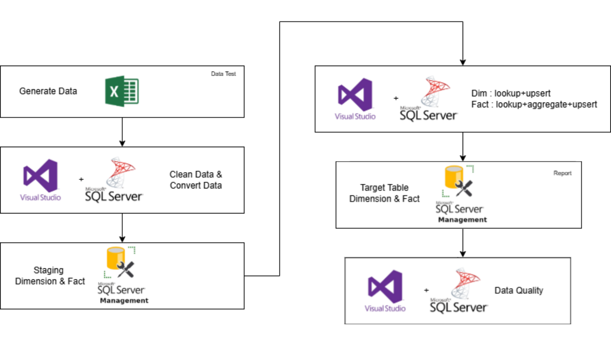
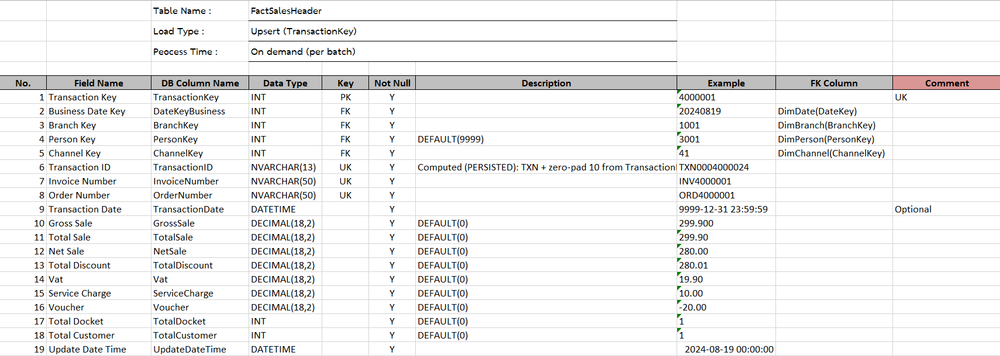
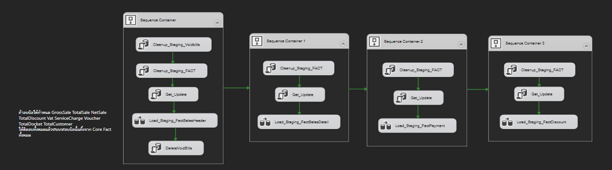
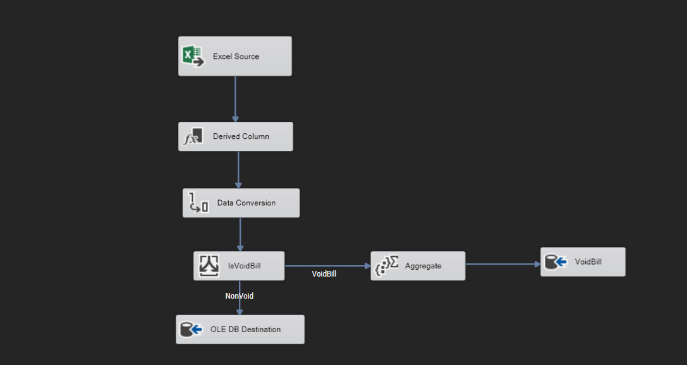
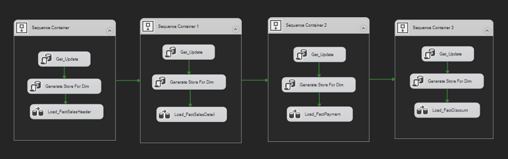
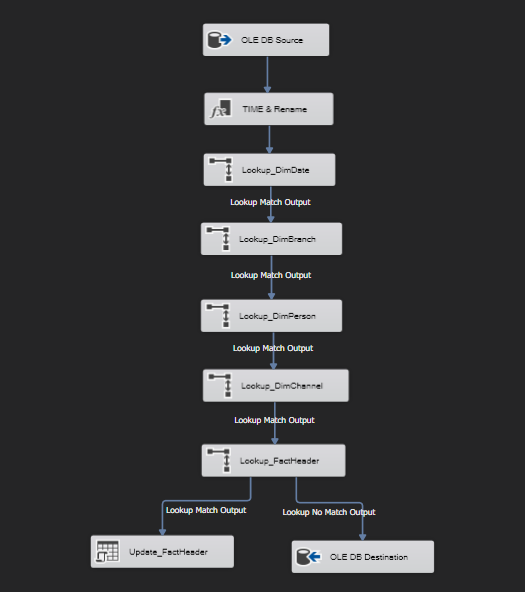
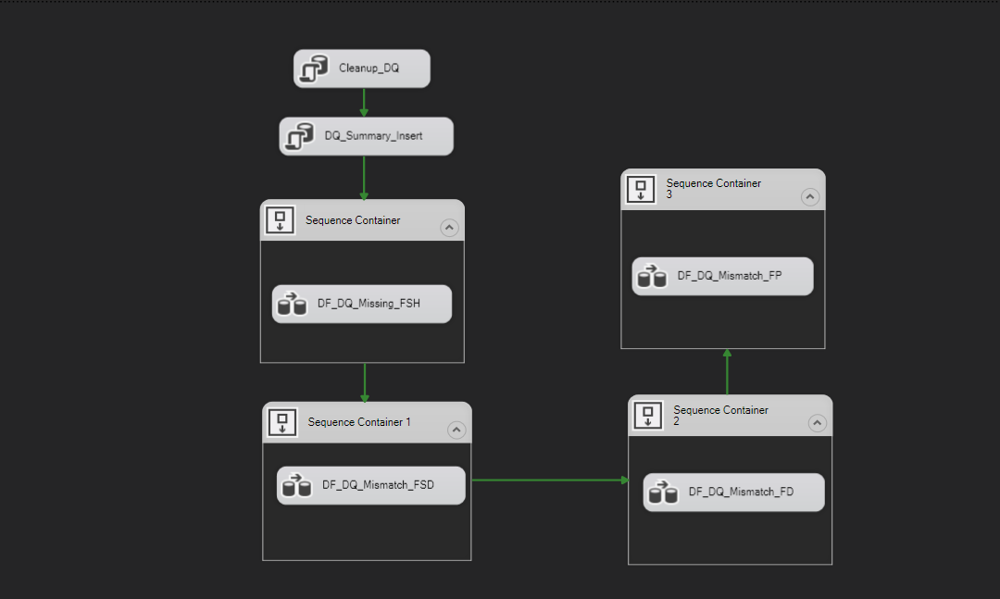
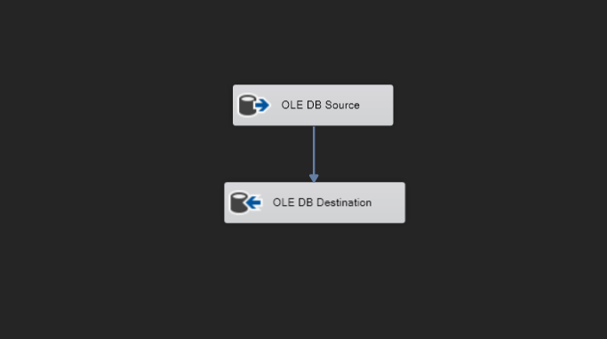

# Sales Data Mart ETL

Sales Data Mart ETL is a data engineering portfolio project that demonstrates the design and development of a Sales Data Mart for sales analysis. The project uses structured mockup Excel data as the source input and loads data through Microsoft SQL Server and SQL Server Integration Services (SSIS) into staging and target Data Mart tables.

## Features

- Load structured mockup Excel data into staging tables
- Separate staging and target Data Mart database layers
- Process dimension and fact tables through SSIS workflows
- Use lookup, aggregate, and upsert logic for loading target tables
- Handle void and cancelled transactions before final reporting
- Perform Data Quality checks by comparing staging data with target Data Mart results
- Prepare clean sales data for reporting, dashboarding, and analysis

## Tech Stack

- Microsoft SQL Server
- SQL Server Integration Services (SSIS)
- SQL Server Management Studio (SSMS)
- Visual Studio
- Excel
- Data Mart
- ETL
- Star Schema
- Data Quality

## Project Overview

The project was designed to centralize sales data into a standardized structure for easier reporting and analysis.

The system separates data processing into two main database layers:

1. **Staging Layer**  
   Stores structured source data loaded from mockup Excel files. This layer is also used for staging tables, void transaction handling, and Data Quality comparison.

2. **Target Data Mart Layer**  
   Stores final dimension and fact tables for reporting and analysis.

Data Quality checks are performed by comparing staging data with target Data Mart tables to validate loading accuracy, missing records, mismatch records, and transaction consistency.

## ETL Workflow

1. Structured mockup Excel transaction data is generated as the source input.
2. SSIS loads the source data into staging dimension and fact tables.
3. Existing staging data is cleared before loading new input data.
4. Void or cancelled transactions are checked and handled before final reporting.
5. Staging records are loaded into target Data Mart tables.
6. Dimension data is processed using lookup and upsert logic.
7. Fact data is processed using lookup, aggregation, and upsert logic.
8. Data Quality checks compare staging data with target Data Mart results.

## Database Design

The project uses two database layers:

- **Datamart_Staging**  
  Contains staging dimension and fact tables, incoming data, void transaction handling, and Data Quality result tables.

- **Datamart_LOAD / Target**  
  Contains final dimension and fact tables used for reporting and analysis.

## My Role

- Designed the Sales Data Mart structure
- Designed staging and target database layers
- Built SSIS workflows for Excel-to-Staging and Staging-to-Target loading
- Implemented dimension loading using lookup and upsert logic
- Implemented fact loading using lookup, aggregation, and upsert logic
- Supported Data Quality validation by comparing staging and target records
- Prepared project documentation including ER Diagram and Data Dictionary

## Repository Structure

```text
sales-datamart-etl/
├── README.md
├── database/
│   ├── staging_schema.sql
│   └── datamart_schema.sql
├── sample_data/
│   ├── README.md
│   └── datamart_mockup.xlsx
└── docs/
    ├── data-dictionary.png
    ├── data-dictionary.xlsx
    ├── er-diagram.png
    ├── project-architecture.png
    ├── ssis-staging-control-flow.png
    ├── ssis-staging-data-flow.png
    ├── ssis-load-control-flow.png
    ├── ssis-load-data-flow.png
    ├── ssis-dq-control-flow.png
    └── ssis-dq-data-flow.png
```

## Screenshots

### Project Architecture


### ER Diagram


### Data Dictionary Preview


### SSIS Staging Control Flow


### SSIS Staging Data Flow Example


### SSIS Load Control Flow


### SSIS Load Data Flow Example


### SSIS Data Quality Control Flow


### SSIS Data Quality Data Flow


The SSIS screenshots show representative examples from the staging, load, and Data Quality processes. The full project contains multiple workflows for dimension loading, fact loading, lookup logic, aggregation logic, upsert processing, and Data Quality validation.

## Mockup Data

This project uses structured mockup Excel data only.  
The source data is prepared in a clean tabular format before being loaded into staging tables.

[View Mockup Data](sample_data/datamart_mockup.xlsx)

> GitHub may not preview the Excel file directly because of its file size. Please use **Download**, **View raw**, or open the file in Microsoft Excel.

A short note about the mockup dataset is also provided in:

[Mockup Data README](sample_data/README.md)

## Database Schemas

- [Staging Schema](database/staging_schema.sql)
- [Data Mart Schema](database/datamart_schema.sql)

## Data Dictionary

The data dictionary describes table structures, column definitions, data types, key fields, nullable fields, descriptions, examples, and relationships used in the project.

- [View Data Dictionary Excel](docs/data-dictionary.xlsx)

## Note

This repository uses mockup data only. It does not include any private customer data, production records, database credentials, server information, or confidential company information.
